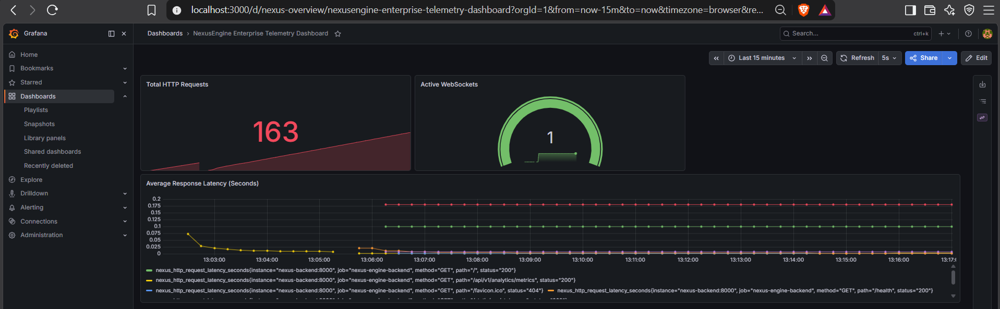
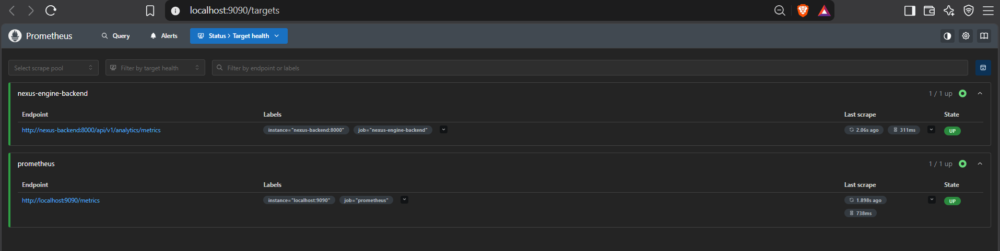
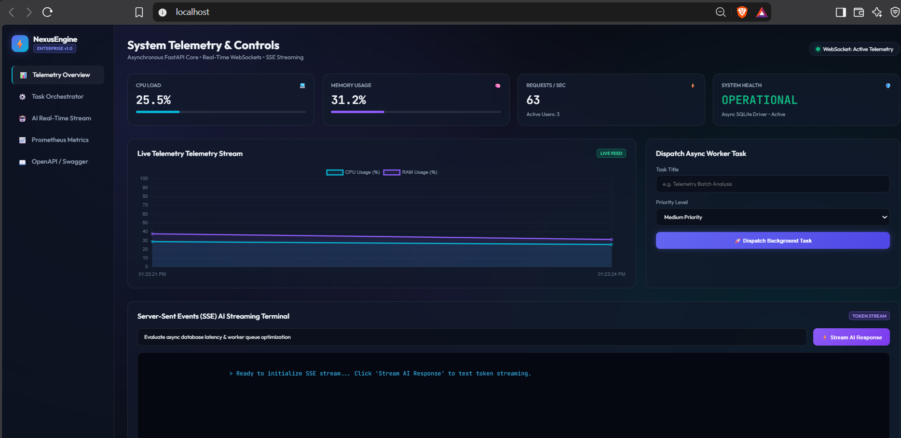
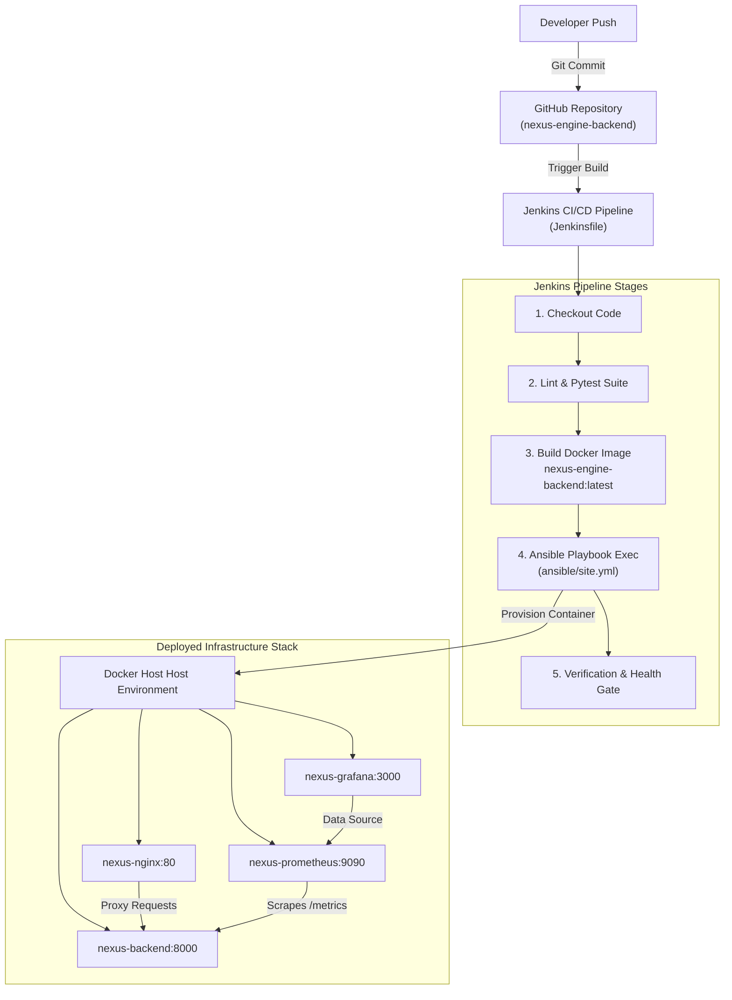
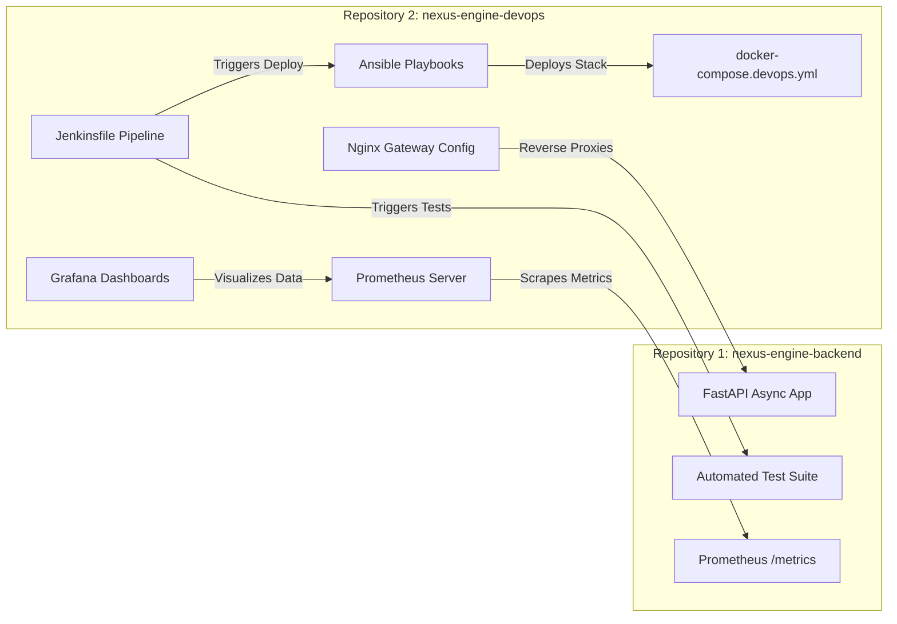

# NexusEngine Enterprise - DevOps & Operations

[](https://www.jenkins.io/)
[](https://www.ansible.com/)
[](https://www.docker.com/)
[](https://nginx.org/)
[](https://prometheus.io/)
[](https://grafana.com/)
[](https://github.com/features/actions)
[](LICENSE)

> Production-grade DevOps Infrastructure, CI/CD Pipeline, Infrastructure as Code (IaC), Nginx API Gateway, and Prometheus/Grafana Telemetry Monitoring stack for the **NexusEngine Enterprise Platform**.

---

> ### 🔗 Repository Ecosystem Link
> This repository contains deployment automation, infrastructure playbooks, and observability stacks.  
> **Application source code, API routers, WebSockets, SSE AI streaming, background workers, and web UI are maintained in the companion repository:**  
> 👉 **[NexusEngine Backend Core Repository](../nexus-engine-backend)**

---

## 📸 Screenshots & Infrastructure Showcase

<div align="center">

### 📊 1. Grafana Production Observability Dashboard
*Real-time visualizations for HTTP RPS, latency distribution, active WebSockets, and system load.*



<br/>

### 🎯 2. Prometheus Scraping & Target Health
*Prometheus scraping FastAPI `/api/v1/analytics/metrics` endpoint with 5-second interval.*



<br/>

### 🐳 3. Multi-Container Orchestration & API Gateway
*Unified Docker Compose topology fronted by Nginx with WebSocket upgrade and SSE support.*



</div>

---


## 🎯 Purpose & Scope

In modern software engineering organizations, application source code and infrastructure operations are decoupled into dedicated repositories. **NexusEngine DevOps** automates the end-to-end lifecycle of the **NexusEngine Backend**:

1. **Continuous Integration**: Declarative Jenkins pipeline pulling code, installing dependencies, and running `pytest`.
2. **Container Build**: Multi-stage Docker builds producing optimized production images.
3. **Automated Provisioning**: Idempotent Ansible playbooks deploying containers and configuring host settings.
4. **API Gateway & Proxying**: Nginx handling reverse proxying, WebSockets upgrade headers, and SSE buffer management.
5. **Real-Time Observability**: Prometheus scraping FastAPI `/metrics` and rendering metrics in Grafana dashboards.

---

## 📐 Architecture & Flow Diagrams

### 1. End-to-End CI/CD Deployment Flow



---

### 2. Repository Relationship Topology



---

## 📂 Repository Directory Structure

```
nexus-engine-devops/
├── ansible/                          # Infrastructure as Code (IaC)
│   ├── inventory/
│   │   └── hosts.ini                 # Inventory target definition
│   ├── roles/
│   │   ├── docker/                   # Docker verification role
│   │   │   └── tasks/main.yml
│   │   ├── nexus_app/                # Backend app container deployment role
│   │   │   └── tasks/main.yml
│   │   └── nginx/                    # Nginx reverse proxy deployment role
│   │       ├── tasks/main.yml
│   │       └── templates/nginx.conf.j2 # Dynamic Jinja2 Nginx template
│   ├── ansible.cfg                   # Ansible configuration
│   └── site.yml                      # Master deployment playbook
├── jenkins/                          # CI/CD Automation
│   ├── Jenkinsfile                   # Multi-stage declarative build pipeline
│   └── jenkins-docker-setup.sh       # Local containerized Jenkins setup script
├── monitoring/                       # Observability Stack
│   ├── grafana/
│   │   ├── dashboards/
│   │   │   └── nexus-overview.json   # Pre-configured Grafana telemetry dashboard
│   │   └── provisioning/
│   │       ├── dashboards/dashboard.yml
│   │       └── datasources/datasource.yml
│   └── prometheus/
│       └── prometheus.yml            # Telemetry scraper targeting FastAPI /metrics
├── nginx/
│   └── nginx.conf                    # Production API Gateway configuration
├── scripts/                          # Automation Utilities
│   ├── deploy.sh                     # One-click master deployment script
│   └── status_check.sh               # Stack container health check script
├── .github/
│   └── workflows/
│       └── devops-ci.yml             # GitHub Actions CI syntax validation
├── .gitignore                        # Git exclusion rules
├── CHANGELOG.md                      # Infrastructure release notes
├── CODE_OF_CONDUCT.md                # Code of Conduct
├── CONTRIBUTING.md                   # DevOps contribution guidelines
├── docker-compose.devops.yml         # Master multi-container deployment stack
├── LICENSE                           # MIT License
├── SECURITY.md                       # Security policy
└── README.md                         # Infrastructure documentation
```

---

## ⚙️ Detailed Component Deep-Dive

### 1. Jenkins Declarative Pipeline (`jenkins/Jenkinsfile`)
- **Stage 1: Checkout Code**: Pulls backend application code.
- **Stage 2: Lint & Pytest Suite**: Executes `pytest -v tests/` inside Python virtual environment.
- **Stage 3: Build Container Image**: Builds Docker image `nexus-engine-backend:latest`.
- **Stage 4: Ansible Provision & Deploy**: Triggers `ansible-playbook -i inventory/hosts.ini site.yml`.
- **Stage 5: Verification & Health Gate**: Executes `curl -f http://localhost:80/health` and `/metrics`.

### 2. Ansible Infrastructure as Code (`ansible/`)
- **Idempotent Execution**: Verifies host state before running tasks.
- **Role `docker`**: Ensures Docker engine and Compose plugin availability.
- **Role `nexus_app`**: Deploys backend application container stack.
- **Role `nginx`**: Templates and reloads Nginx reverse proxy configs dynamically.

### 3. Nginx API Gateway (`nginx/nginx.conf`)
- **Root Proxy (`/`)**: Routes dashboard and REST requests to `nexus-backend:8000`.
- **WebSocket Upgrade (`/ws/`)**: Configures `Upgrade` and `Connection` headers with long timeout.
- **SSE AI Streaming (`/api/v1/ai/stream`)**: Sets `proxy_buffering off`, `proxy_cache off`, and `chunked_transfer_encoding off`.

### 4. Prometheus & Grafana Monitoring (`monitoring/`)
- **Prometheus Scraper**: Pulls `/api/v1/analytics/metrics` every 5 seconds.
- **Grafana Dashboards**: Pre-provisioned visual gauges for HTTP Request RPS, latency trends, and active WebSocket connection counts.

---

## 🚀 Deployment Instructions

### One-Click Deployment
```bash
cd nexus-engine-devops
./scripts/deploy.sh
```

### Direct Docker Compose Launch
```bash
docker compose -f docker-compose.devops.yml up -d --build
```

---

## 🌐 Deployed Endpoints Table

| Service | Local URL | Default Credentials / Notes |
| :--- | :--- | :--- |
| **Nginx API Gateway** | [http://localhost:80](http://localhost:80) | Production Entry Point |
| **FastAPI Backend (Direct)** | [http://localhost:8000/docs](http://localhost:8000/docs) | Swagger API Documentation |
| **Jenkins CI/CD Server** | [http://localhost:8080](http://localhost:8080) | Local Jenkins Instance |
| **Prometheus Telemetry** | [http://localhost:9090](http://localhost:9090) | Telemetry Target Scraper |
| **Grafana Visualizer** | [http://localhost:3000](http://localhost:3000) | Username: `admin` / Password: `admin` |

---

## 📄 License

Distributed under the MIT License. See [`LICENSE`](LICENSE) for more information.
